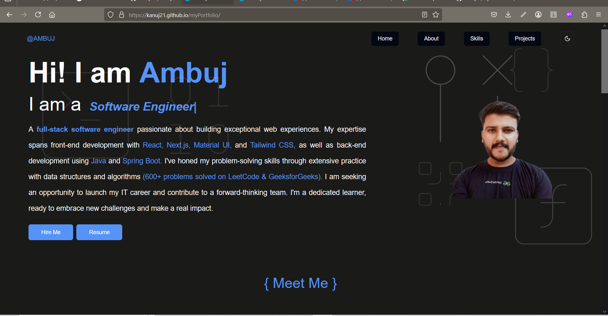

# 🚀 My Portfolio - [Ambuj Vats](https://kanuj21.github.io/myPortfolio/)


Welcome to my **professional portfolio**, built using **Next.js, TypeScript, and Tailwind CSS**. This portfolio showcases my skills, projects, and experience as a **Full-Stack Developer**.

## 🌟 Features
- **🚀 Fast & Responsive** – Optimized for all devices.
- **🎨 Elegant UI** – Clean and modern design with **Tailwind CSS**.
- **📄 Dynamic Projects Section** – 


## Preview


## Getting Started

First, run the development server:

```bash
npm run dev
# or
yarn dev
# or
pnpm dev
# or
bun dev
```

Open [http://localhost:3000](http://localhost:3000) with your browser to see the result.

You can start editing the page by modifying `app/page.tsx`. The page auto-updates as you edit the file.

This project uses [`next/font`](https://nextjs.org/docs/app/building-your-application/optimizing/fonts) to automatically optimize and load [Geist](https://vercel.com/font), a new font family for Vercel.

## Learn More

To learn more about Next.js, take a look at the following resources:

- [Next.js Documentation](https://nextjs.org/docs) - learn about Next.js features and API.
- [Learn Next.js](https://nextjs.org/learn) - an interactive Next.js tutorial.

You can check out [the Next.js GitHub repository](https://github.com/vercel/next.js) - your feedback and contributions are welcome!

## 🌟 Support This Project!  

If you find this project helpful, please **give it a star ⭐ on GitHub**!  
Your support motivates me to keep improving it.  

🔗 **Visit My Portfolio:** [myportfolio](https://my-portfolio-green-omega.vercel.app/)  
💬 **Follow Me:** [LinkedIN](https://www.linkedin.com/in/ambuj-vats-649a7b11b/)  
